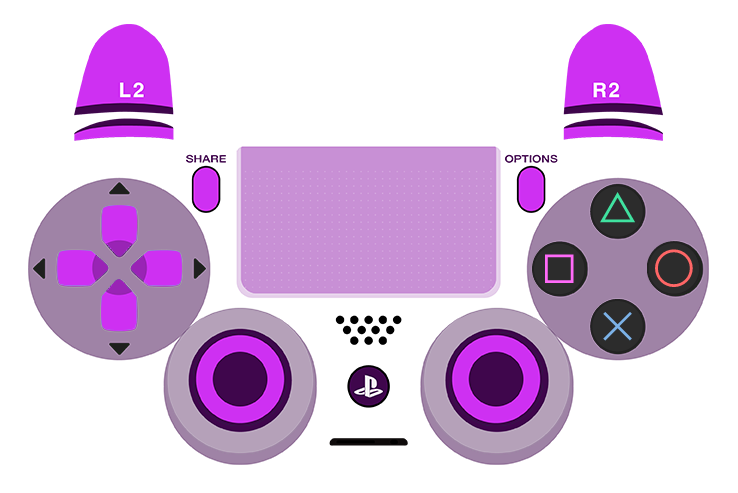

# ControllerOverlays
Some nice looking GamePad Viewer overlays

### How to use (in OBS)
1. Add a new browser source
2. Double click the source to open properties
3. Copy/paste any one of the URLs below into the URL field
4. Click OK

## PS4


### Purple transparent



```
https://gamepadviewer.com/?p=1&s=5&editcss=https://smallest-cock.github.io/ControllerOverlays/css/ps4_transparent_purple.css
```

### Pink transparent


```
https://gamepadviewer.com/?p=1&s=5&editcss=https://smallest-cock.github.io/ControllerOverlays/css/ps4_transparent_pink.css
```

### Blue transparent


```
https://gamepadviewer.com/?p=1&s=5&editcss=https://smallest-cock.github.io/ControllerOverlays/css/ps4_transparent_blue.css
```

### Gray transparent


```
https://gamepadviewer.com/?p=1&s=5&editcss=https://smallest-cock.github.io/ControllerOverlays/css/ps4_transparent_gray.css
```


## Mine


```
https://gamepadviewer.com/?p=1&s=5&editcss=https://smallest-cock.github.io/ControllerOverlays/css/ps4_transparent_sslow.css
```