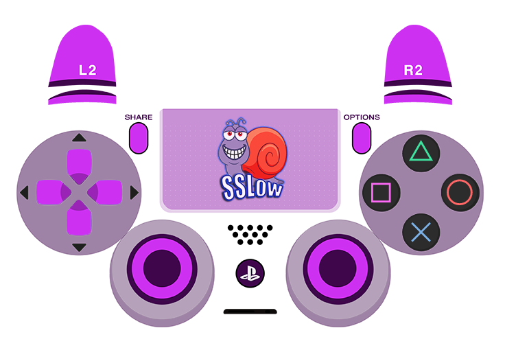

# ControllerOverlays
Some nice looking GamePad Viewer overlays

### How to use
1. Add a new browser source in OBS
2. Double click the source
3. Copy/paste any one of the URLs below into the URL field
4. Click OK

## PS4

### Mine



```
https://gamepadviewer.com/?p=1&s=5&editcss=https://smallest-cock.github.io/ControllerOverlays/css/sslow_rl_ps4.css
```

### Purple transparent


```
https://gamepadviewer.com/?p=1&s=5&editcss=https://smallest-cock.github.io/ControllerOverlays/css/transparent_purple_ps4.css
```

